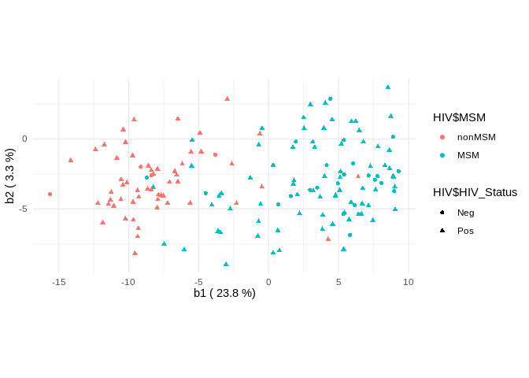
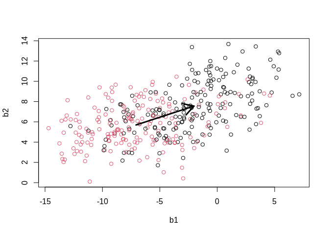

<!-- README.md is generated from README.Rmd. Please edit that file -->

# NearestBalance

<!-- badges: start -->
<!-- badges: end -->

The goal of NearestBalance is to …

<!-- ## Installation -->
<!-- You can install the released version of NearestBalance from [CRAN](https://CRAN.R-project.org) with: -->
<!-- ``` r -->
<!-- install.packages("NearestBalance") -->
<!-- ``` -->

## Quick start guide

Load data for the example

    #> Loading required package: MASS
    #> Loading required package: NADA
    #> Loading required package: survival
    #> 
    #> Attaching package: 'NADA'
    #> The following object is masked from 'package:stats':
    #> 
    #>     cor
    #> Loading required package: truncnorm
    #> No. corrected values:  820

## Principal balance analysis with NearestBalance



    #> $num
    #>  [1] "g_Alloprevotella"                      
    #>  [2] "g_RC9_gut_group"                       
    #>  [3] "g_Prevotella"                          
    #>  [4] "f_vadinBB60_g_unclassified"            
    #>  [5] "g_Succinivibrio"                       
    #>  [6] "g_Oribacterium"                        
    #>  [7] "o_Bacteroidales_g_unclassified"        
    #>  [8] "k_Bacteria_g_unclassified"             
    #>  [9] "g_Dialister"                           
    #> [10] "g_Solobacterium"                       
    #> [11] "g_Catenibacterium"                     
    #> [12] "g_Victivallis"                         
    #> [13] "g_Anaerovibrio"                        
    #> [14] "g_Intestinimonas"                      
    #> [15] "f_Erysipelotrichaceae_g_Incertae_Sedis"
    #> [16] "f_Rikenellaceae_g_unclassified"        
    #> [17] "g_Anaerotruncus"                       
    #> [18] "g_Megasphaera"                         
    #> [19] "g_Phascolarctobacterium"               
    #> [20] "g_Mitsuokella"                         
    #> 
    #> $den
    #>  [1] "g_Alistipes"                         
    #>  [2] "g_Barnesiella"                       
    #>  [3] "g_Bacteroides"                       
    #>  [4] "g_Odoribacter"                       
    #>  [5] "g_Parabacteroides"                   
    #>  [6] "f_Porphyromonadaceae_g_unclassified" 
    #>  [7] "g_Thalassospira"                     
    #>  [8] "g_Butyricimonas"                     
    #>  [9] "g_Anaerostipes"                      
    #> [10] "g_Paraprevotella"                    
    #> [11] "f_Erysipelotrichaceae_g_unclassified"
    #> [12] "g_Streptococcus"                     
    #> [13] "g_Bifidobacterium"                   
    #> [14] "g_Blautia"                           
    #> [15] "g_Collinsella"

## Regression analysis

``` r
nb_2 <- nb_lm(abundance = abundance,
              metadata = HIV,
              pred = "MSM",
              cov = "HIV_Status")
```

Statistical significance of the association

``` r
summary(manova(nb_2$lm_res))
#>             Df  Pillai approx F num Df den Df  Pr(>F)    
#> MSM          1 0.82537   7.5300     59     94 < 2e-16 ***
#> HIV_Status   1 0.45820   1.3474     59     94 0.09761 .  
#> Residuals  152                                           
#> ---
#> Signif. codes:  0 '***' 0.001 '**' 0.01 '*' 0.05 '.' 0.1 ' ' 1
```

nearest balance interpretation of the regression coefficient

``` r
nb_2$nb$b1
#> $num
#>  [1] "g_Alloprevotella"                      
#>  [2] "g_Prevotella"                          
#>  [3] "g_Succinivibrio"                       
#>  [4] "g_RC9_gut_group"                       
#>  [5] "g_Dialister"                           
#>  [6] "f_vadinBB60_g_unclassified"            
#>  [7] "g_Phascolarctobacterium"               
#>  [8] "g_Oribacterium"                        
#>  [9] "f_Erysipelotrichaceae_g_Incertae_Sedis"
#> [10] "k_Bacteria_g_unclassified"             
#> [11] "g_Catenibacterium"                     
#> [12] "o_Bacteroidales_g_unclassified"        
#> [13] "g_Intestinimonas"                      
#> [14] "g_Megasphaera"                         
#> [15] "g_Mitsuokella"                         
#> [16] "g_Solobacterium"                       
#> [17] "g_Victivallis"                         
#> [18] "g_Anaerovibrio"                        
#> 
#> $den
#>  [1] "g_Alistipes"                         "g_Barnesiella"                      
#>  [3] "g_Bacteroides"                       "g_Odoribacter"                      
#>  [5] "g_Parabacteroides"                   "f_Porphyromonadaceae_g_unclassified"
#>  [7] "g_Thalassospira"                     "g_Butyricimonas"                    
#>  [9] "g_Anaerostipes"                      "g_Paraprevotella"                   
#> [11] "g_Streptococcus"                     "g_Bifidobacterium"                  
#> [13] "g_Escherichia-Shigella"
```

## Interpretation of the SVM results

``` r
nb_3 <- nb_svm(abundance = abundance,
               f = HIV$HIV_Status)
```

The nearest balance for the discriminating direction

``` r
nb_3$nb$b1
#> $num
#>  [1] "f_Ruminococcaceae_g_unclassified"    
#>  [2] "g_Bacteroides"                       
#>  [3] "g_Succinivibrio"                     
#>  [4] "f_Erysipelotrichaceae_g_unclassified"
#>  [5] "g_Alistipes"                         
#>  [6] "f_Defluviitaleaceae_g_Incertae_Sedis"
#>  [7] "g_Blautia"                           
#>  [8] "g_Alloprevotella"                    
#>  [9] "o_Clostridiales_g_unclassified"      
#> [10] "g_Megasphaera"                       
#> [11] "g_Solobacterium"                     
#> [12] "g_Subdoligranulum"                   
#> [13] "f_Rikenellaceae_g_unclassified"      
#> [14] "g_Anaerovibrio"                      
#> [15] "g_Odoribacter"                       
#> [16] "g_Escherichia-Shigella"              
#> [17] "g_Bifidobacterium"                   
#> 
#> $den
#>  [1] "g_Butyricimonas"                    "f_Ruminococcaceae_g_Incertae_Sedis"
#>  [3] "g_Streptococcus"                    "g_Oribacterium"                    
#>  [5] "g_Dialister"                        "g_Dorea"                           
#>  [7] "g_Anaeroplasma"                     "f_vadinBB60_g_unclassified"        
#>  [9] "g_RC9_gut_group"                    "g_Paraprevotella"                  
#> [11] "g_Brachyspira"                      "g_Elusimicrobium"                  
#> [13] "f_Lachnospiraceae_g_unclassified"
```

## Interpretation of the LDA results

``` r
nb_4 <- nb_lda(abundance = abundance,
               f = HIV$HIV_Status)
```

The nearest balance for the discriminating direction

``` r
nb_4$nb$b1
#> $num
#>  [1] "f_Ruminococcaceae_g_unclassified"    
#>  [2] "g_Blautia"                           
#>  [3] "g_Bacteroides"                       
#>  [4] "f_Erysipelotrichaceae_g_unclassified"
#>  [5] "g_Anaerovibrio"                      
#>  [6] "g_Solobacterium"                     
#>  [7] "g_Bifidobacterium"                   
#>  [8] "g_Subdoligranulum"                   
#>  [9] "g_Roseburia"                         
#> [10] "g_Alistipes"                         
#> [11] "f_Defluviitaleaceae_g_Incertae_Sedis"
#> [12] "g_Succinivibrio"                     
#> 
#> $den
#> [1] "f_Lachnospiraceae_g_Incertae_Sedis" "g_Oribacterium"                    
#> [3] "f_Ruminococcaceae_g_Incertae_Sedis" "g_Butyricimonas"                   
#> [5] "f_Lachnospiraceae_g_unclassified"   "g_RC9_gut_group"
```

## Interpretation of differences between two samples

``` r
counts <- HFD[1:193]
counts_filt <- counts[, colSums(counts > 0) > 0.5*nrow(counts)]
abundance <- cmultRepl(counts_filt)
#> No. corrected values:  866
meta <- HFD[, c("sample_id", "subject_id", "group")]
pairs <- dcast(meta, subject_id ~ group, value.var = "sample_id")

nb_5 <- nb_shift(abundance = abundance,
                 samp_1 = pairs$after[1],
                 samp_2 = pairs$before[1])
```

The nearest balance to the microbiome shift of the first subject

``` r
nb_5$b1
#> $num
#> [1] "g__Butyricimonas"         "g__Veillonella"          
#> [3] "g__Sutterella"            "g__Phascolarctobacterium"
#> [5] "g__Odoribacter"           "g__Bacteroides"          
#> [7] "f__[Barnesiellaceae];g__" "g__Parabacteroides"      
#> [9] "f__Clostridiaceae;g__"   
#> 
#> $den
#> [1] "f__Staphylococcaceae;g__" "g__Staphylococcus"       
#> [3] "g__Prevotella"            "g__Dialister"            
#> [5] "g__Streptococcus"         "o__RF39;f__;g__"
```

Impact of the nearest balance in the total shift

``` r
nb_5$impact
#> [1] 0.8009809
```

## Interpretation of the mean shift in the sample

``` r
nb <- nb_mean_shift(abundance, pairs$before, pairs$after, "two_balances")

plot(nb$coord$b1, nb$coord$b2, col = as.factor(HFD$group), xlab = "b1", ylab = "b2")
arrows(mean(nb$coord[pairs$before, "b1"]),
  mean(nb$coord[pairs$before, "b2"]),
  mean(nb$coord[pairs$before, "b1"]) + nb$nb$coord["b1"],
  mean(nb$coord[pairs$before, "b2"]) + nb$nb$coord["b2"],
  lwd =3)
```



Statistical significance of the shift

``` r
summary(manova(nb$lm_res),intercept = T)
#>              Df Pillai approx F num Df den Df    Pr(>F)    
#> (Intercept)   1 0.6655   6.5239     43    141 < 2.2e-16 ***
#> Residuals   183                                            
#> ---
#> Signif. codes:  0 '***' 0.001 '**' 0.01 '*' 0.05 '.' 0.1 ' ' 1
```

Members of the nearest balance to the mean shift

``` r
nb$nb$b1
#> $num
#> [1] "g__Staphylococcus"        "g__Acinetobacter"        
#> [3] "f__Staphylococcaceae;g__" "g__Actinomyces"          
#> 
#> $den
#> [1] "g__Odoribacter"           "g__Butyricimonas"        
#> [3] "g__Bacteroides"           "g__Sutterella"           
#> [5] "g__Parabacteroides"       "f__[Barnesiellaceae];g__"
#> [7] "g__Phascolarctobacterium" "f__Rikenellaceae;g__"    
#> [9] "g__Lachnospira"
```

Impact

``` r
nb$nb$impacts
#>        b1        b2 
#> 0.8387473 0.1143482
```

Proportion of noise in data to the mean shift

``` r
nb$noise
#> [1] 0.1634847
```
